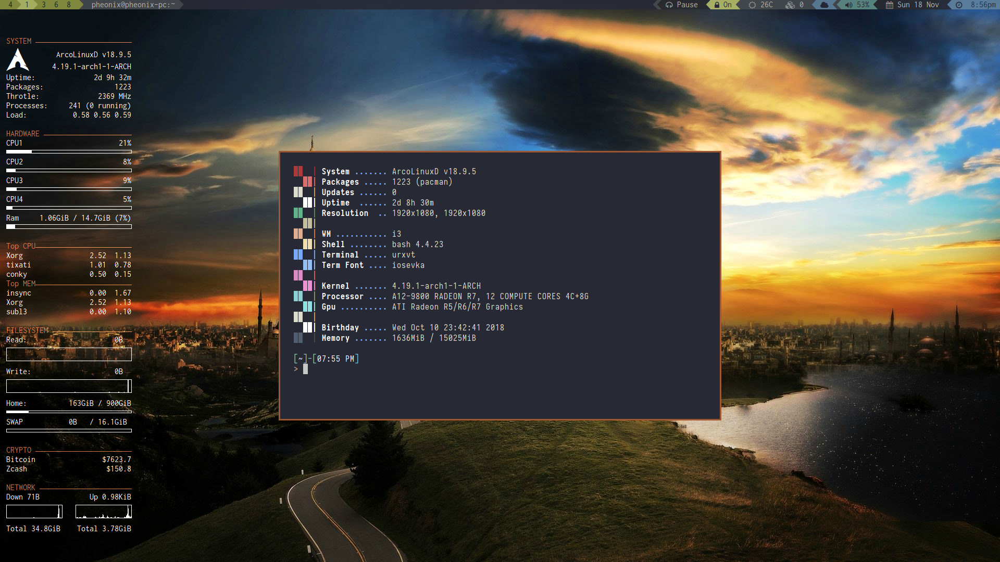
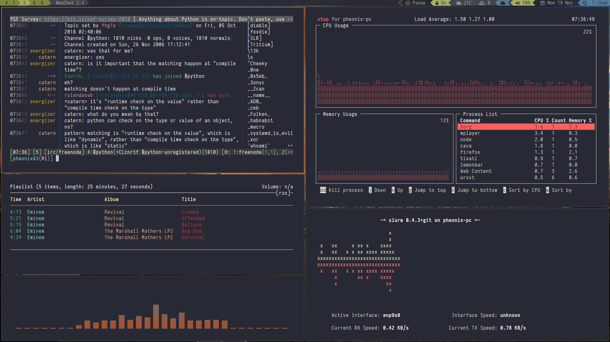

# ArcoLinux-dotfiles

NOTE
----
These are my dotfiles for my ArcoLinux install, it contains 2bwm and i3-gaps-next. the Screenshots below are of i3-gaps wm. my primary wm for my laptop is 2bwm.

PROGRAMS
---
* URxvt (Terminal)
* Thunar (File Manager)
* Rofi (Application Launcher)
* Dunst (Notifications)
* Weechat (IRC)
* vtop (System Monitor)
* cava (Equalizer)
* ncmpcpp/mpd (Music Player)
* Slurm (Network Monitor)
* Conky (System Monitor)
* Lemonbar (Panel/Bar)
* Sublime-Text (Editor)
* MPlayer (Video Player)

